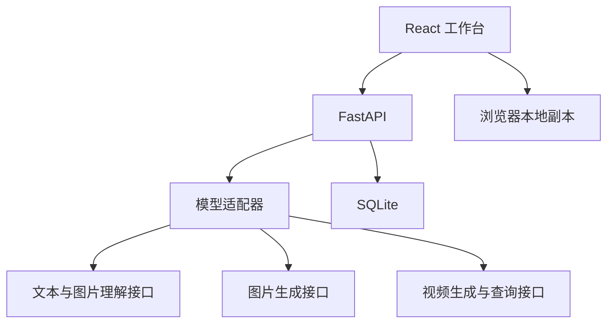

# DuiZhao 开发说明

对应 2026-09-24 源码状态。产品功能与安装入口见 [README](../README.md)，人工测评口径见 [测评任务与报告](测评任务与报告.md)。当前行为以源码和本说明为准。

## 技术结构

| 层 | 当前实现 |
| --- | --- |
| 前端 | React 19、Ant Design / Pro Components、CSS、Motion |
| 内容展示 | react-markdown、remark-gfm，图片与视频预览组件 |
| 构建 | esbuild，将脚本、样式和引用图片打包到 HTML |
| 导出 | SheetJS `xlsx`、Markdown、JSON |
| 后端 | Python、FastAPI、HTTPX |
| 模型输出 | 独立异步任务，经 SSE 汇聚到前端 |
| 存储 | SQLite 与浏览器 localStorage |



C2C 目前沿用前端预置演示，没有接入实际缓存推理服务。

## 关键文件

| 文件 | 职责 |
| --- | --- |
| `src/arena.jsx` / `arena.css` | 主界面、内容类型、模型配置、话题与媒体结果 |
| `src/api.mjs` / `sse.mjs` | 后端调用与 SSE 读取 |
| `src/model-connections.*` | 预设、连接信息、地址提示和状态 |
| `src/answer-stream.mjs` / `streamed-answer.jsx` | 各模型独立输出、停止状态和 Markdown 展示 |
| `src/attachments.mjs` / `composer-controls.jsx` | 附件识别、图片读取与输入框控件 |
| `src/prompt-library.*` | 题库与测评标准编辑 |
| `src/evaluations.mjs` / `evaluations-ui.jsx` | 人工测评、评分、汇总和报告 |
| `src/pricing.mjs` | 人民币费用估算与计费单位 |
| `src/excel.mjs` | Excel Blob 与下载 |
| `backend/app/main.py` | API 路由、任务并发、事件推送、取消和静态页面 |
| `backend/app/adapter.py` / `endpoints.py` | 上游调用、协议适配、地址与错误处理 |
| `backend/app/registry.py` / `connection_status.py` | 模型注册、密钥引用与诊断状态 |
| `backend/app/media.py` | 生成媒体保存及访问文件 |
| `backend/app/db.py` / `schemas.py` | SQLite 操作与请求校验 |
| `backend/config/models.json` | 后端预设注册表，密钥只用引用名称 |

## 本地开发

使用 Node.js 22 或更新版本，后端建议 Python 3.11。前端依赖通过 `npm ci` 恢复，后端在虚拟环境中安装 `backend/requirements.txt`。

开发启动命令见主 README。前端默认 `127.0.0.1:8768`，后端默认 `127.0.0.1:8000`。

源码修改后开发脚本会重新构建，需要刷新网页。不要直接修改 `arena.html`、`index.html` 或 `loading-demo.html`；这些生成文件已从发布仓库排除，按需本地构建，不手工修改。

### 前后端同域预览

需要由后端直接提供页面时，在仓库根目录执行：

```bash
npm run build
mkdir -p backend/static
cp arena.html index.html loading-demo.html backend/static/
cd backend
python -m uvicorn app.main:app --host 127.0.0.1 --port 8000
```

上述 Python 命令应在已激活的后端虚拟环境中运行。然后打开 `http://127.0.0.1:8000/arena.html`。

`backend/static/` 为构建副本，不提交 Git。每次源码变更后需要重新构建和复制。

### 端口与地址

- 修改前端端口可使用 `PORT=8769 npm run dev`，但后端 CORS 默认仅允许 8768，需同步调整允许来源。
- 修改后端端口需要同时调整启动参数和前端 API 基地址，不能只修改 `.env` 中的 `PORT` 而仍执行 `--port 8000`。
- 前端 API 基地址读取 `window.__BACKEND_URL__`；本地主机默认使用 8000，其他主机默认走同域相对路径。

## API 职责

| 接口 | 用途 |
| --- | --- |
| `GET /health` | 应用健康状态，不验证模型 |
| `GET /api/v1/models` | 模型列表、配置和连接状态，不返回密钥明文 |
| `POST /api/v1/connections/{model_id}/test` | 文本最小真实调用；图片和视频按类型跳过 |
| `POST /api/v1/compare` | 创建当前轮对比任务 |
| `GET /api/v1/compare/{task_id}/events` | SSE 输出、完成、失败等事件 |
| `POST /api/v1/compare/{task_id}/cancel` | 中断本地任务处理 |
| `GET /api/v1/compare/{task_id}` | 查询已保存的任务与结果 |
| `GET / PUT /api/v1/store/{key}` | 会话、题库、测评任务的键值同步 |
| `GET / PUT /api/v1/settings` | 配置状态与密钥/连接设置；读取不回显密钥 |

接口路径应以 `backend/app/main.py` 为准。普通键值接口拒绝读取和覆盖 `backend-settings`，私有配置由专用设置接口处理。

## 模型协议与限制

文本、代码和图片理解使用 OpenAI Chat Completions 兼容流式接口。图片理解将图片数据 URL 放入用户消息内容。后端当前发送共同系统提示词和本轮用户输入，不自动拼入完整历史话题。

图片生成调用 `/images/generations`，将 1024×1024 / 1080P / 2K / 4K 转为上游尺寸，可带参考图，接收 URL 或 base64 结果。不能仅凭更改模型名称认定服务商协议兼容。

视频通过当前适配的 `/api/v1/services/aigc/video-generation/video-synthesis` 提交任务，再查询 `/api/v1/tasks/{task_id}`。图生视频传入首张图片作为参考帧。前端停止等待不等于取消上游任务，后台任务恢复与服务商取消接口仍需完善。

前后端分别维护模型预设。增加预设应同时检查 `src/model-connections.mjs` 与 `backend/config/models.json`，避免名称、能力、ID、地址和密钥引用不一致。

## 数据与密钥

SQLite 默认位置为 `backend/data/duizhao.db`，可以通过 `DATABASE_URL` 指定其他 SQLite 路径。

数据库保存任务、结果及键值配置。会话、题库和人工测评任务同时保留浏览器副本并尝试同步；当前没有完整的离线合并、版本冲突解决或同步失败重试机制。页面内本地保存成功，不保证数据已写入后端。

后端读取本机 `.env` 与环境变量。通过界面保存的密钥位于后端私有设置，优先于相应环境变量；没有设置时可根据 `fallbackKeyRef` 使用继承密钥。当前 SQLite 中的密钥未实现应用层加密，数据库也属于敏感文件。

应排除实际 `.env`、数据库、私钥、部署账号配置、依赖目录和运行缓存；只保留密钥为空的 `.env.example`。当前 `.gitignore` 排除了环境文件、运行数据、部署元数据与私人资料；仍需检查实际提交清单和文件内容。提交前仍需检查 Git 文件清单和密钥扫描结果，不能仅依赖文件名。

## 验证

```bash
# 仓库根目录
npm run build
npm test

# 已激活虚拟环境的后端终端
cd backend
python -m pytest tests -q
```

2026-09-24 最近一次验证记录：前端构建成功，46 项前端测试与 27 项后端测试通过。后端有两条测试依赖弃用提醒。

测试通过只验证所覆盖的逻辑。现有测试使用临时数据库及模拟凭据，不读取用户生产数据库、不调用付费模型。UI 改动应额外检查桌面与手机、明暗主题、键盘操作和状态恢复；模型适配改动需要另行验证协议兼容性。

本次重新执行了上述前后端测试，未调用付费模型。评分规则对照当前计算函数核对。

## 持久化与运行配置

| 环境变量 | 含义 |
| --- | --- |
| `DATABASE_URL` | SQLite 运行路径；默认 `backend/data/duizhao.db` |
| `MEDIA_DIR` | 生成媒体落盘目录；默认 `backend/data/media` |
| `PERSIST_DIR` | 可选持久化挂载目录；存放数据库快照 `duizhao.db` |
| `MAX_UPSTREAM_CONCURRENCY` | 上游并发上限，默认 4 |

媒体通过 `GET /api/v1/media/{filename}` 访问。数据库写入后尝试复制快照；新实例在本地数据库不存在或为空时尝试恢复。备份和恢复异常当前被静默处理，尚无告警与多实例写入协调，因此“配置了 TOS”不等于已经验证灾难恢复。

仅在实际配置挂载后，才将 `MEDIA_DIR` 和 `PERSIST_DIR` 指向该挂载目录。部署包继续排除真实 `.env`、运行数据库、媒体数据、虚拟环境及部署账号信息；本说明不包含真实线上地址或凭据。

上游请求增加了并发控制与部分 429 / 5xx / 509 的退避重试；适用范围以 `adapter.py` 的调用路径为准，不代表所有错误都能自动恢复。

## 费用与导出

`src/pricing.mjs` 维护静态人民币价格表。文本按输入/输出 Token，图片按张数及尺寸倍率，视频按请求时长与分辨率倍率估算。价格表不是实时价格接口，未配置模型返回未计价；文本 usage 缺失时当前可能得到零费用。

普通导出补充真实来源、耗时、首字耗时、Token、媒体引用和费用字段。仍有两个边界：表格在真实记录缺少耗时数据时可能回退示例耗时；Markdown 报告末尾仍沿用演示免责声明，系统分析也不能当成真实自动裁判结果。正式报告应检查来源和缺失值。

## 后续开发重点

- 完整账号鉴权、用户隔离和密钥访问控制；当前 SQLite 密钥未做应用层加密。
- 同步失败提醒、冲突合并、持久化失败告警及多实例一致性。
- 缺失用量和耗时的导出处理、费用估算标识及账单核对。
- 各服务商多模态协议实测、上游取消与任务恢复。
- 测评任务自动批跑、自动裁判及真实 C2C GPU 推理。
